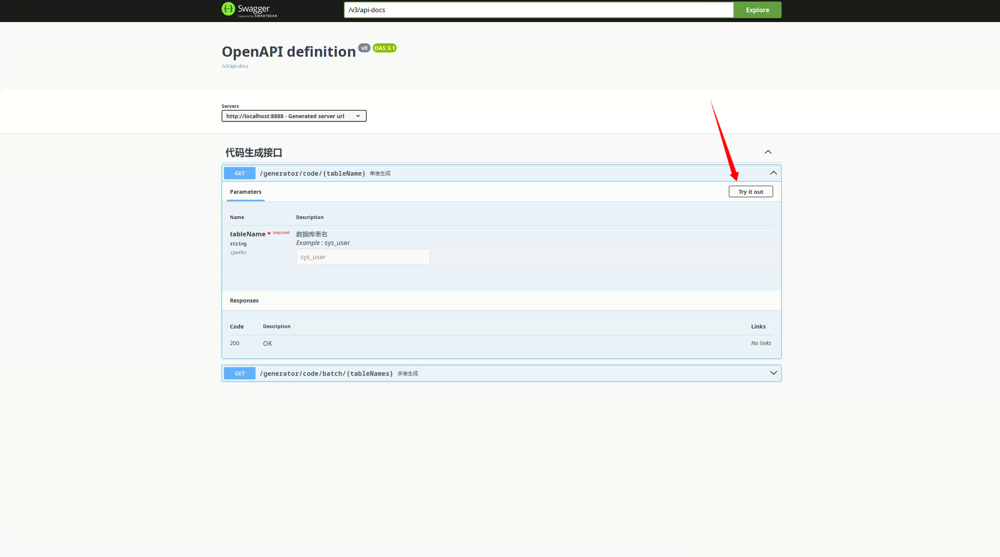
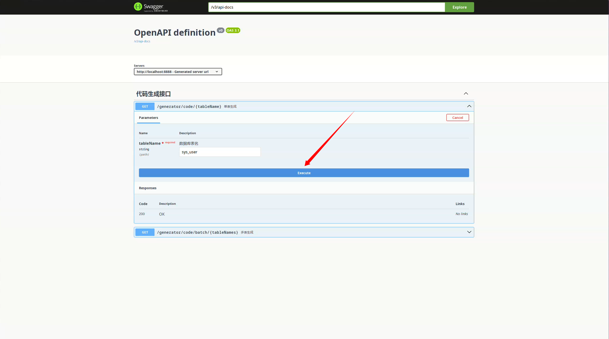
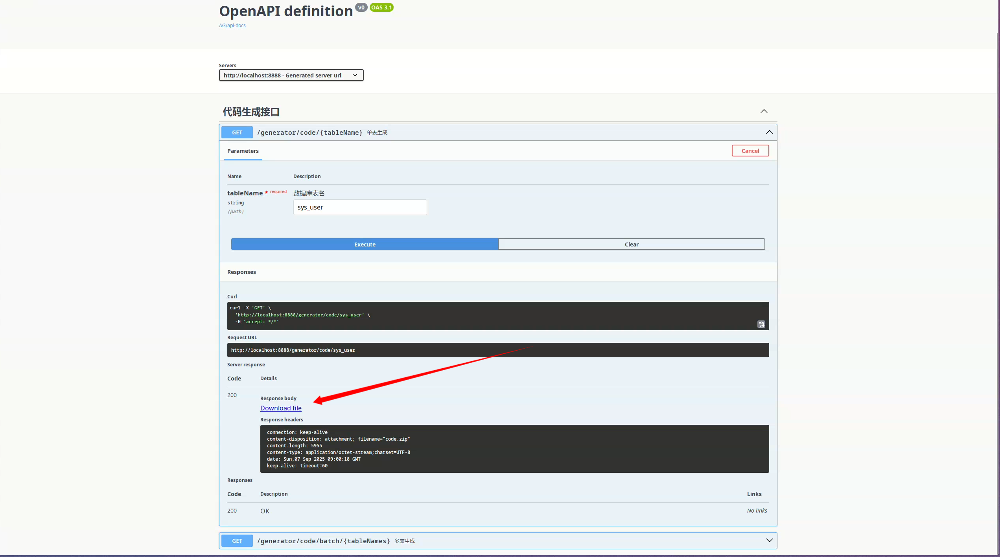

# MyBatis 自动代码生成器

本项目是一个基于 Spring Boot + MyBatis + Thymeleaf 的自动代码生成器，支持根据数据库表结构一键生成 Entity、DTO、Controller、Service、Mapper 及对应 XML 等常用代码.

## 功能特性

- 可自定义包名、作者、表前缀、各层路径及自定义类名前后缀
- 支持单表生成
- 生成代码自动打包下载

## 使用说明

1. 下载或克隆当前项目

```bash
git clone https://github.com/Tomatos03/code-generator.git
```

2. 使用IDE打开当前项目并加载 Maven 依赖

> [!NOTE]
> 默认使用的JDBC实现是Mariadb

3. 在 `application-dev.yml` 配置文件中配置数据库连接和代码生成器配置, 代码生成器可配置属性参考`示例配置`

> [!NOTE]
> `[模块名]` 可选值：`entity`、`condition-entity`、`dto-entity`、`controller`、`service-interface`、`service`、`mapper`、`mapper-xml`

> [!TIP]
> `实际产生的类名 = [prefix] + [表名去前缀后的首字母大写] + [suffix]`

4. 运行当前项目, 访问 `http://localhost:8888/swagger-ui/index.html`, 然后







5. 解压缩下载的Zip包, 即可查看生成的代码, 将其复制到你的项目中使用. 生成的代码需要的Maven依赖:

```xml
    <dependencies>
        <!-- mybatis_spring-boot 启动器 -->
        <dependency>
            <groupId>org.mybatis.spring.boot</groupId>
            <artifactId>mybatis-spring-boot-starter</artifactId>
            <version>3.0.5</version>
        </dependency>

        <dependency>
            <groupId>org.projectlombok</groupId>
            <artifactId>lombok</artifactId>
            <version>1.18.32</version>
        </dependency>

        <dependency>
            <groupId>cn.hutool</groupId>
            <artifactId>hutool-core</artifactId>
            <version>5.8.40</version>
        </dependency>
    </dependencies>
```

### 示例配置

| 属性名                                             | 说明                                       |
| -------------------------------------------------- | ------------------------------------------ |
| `code-generator.author`                            | 生成代码时注释中的作者信息                 |
| `code-generator.package-name`                      | 生成代码的基础包名                         |
| `code-generator.table-prefix`                      | 数据库表名前缀，生成代码时会自动去除该前缀 |
| `code-generator.class-ignore-fields`               | 生成类的时候忽略部分属性                   |
| `code-generator.path-rule-map.[模块名].model-path` | 指定各模块生成的子包路径                   |
| `code-generator.path-rule-map.[模块名].suffix`     | 指定各模块生成类名的后缀                   |
| `code-generator.path-rule-map.[模块名].prefix`     | 指定各模块生成类名的前缀                   |

```yaml
code-generator:
  author: "Tomatos"
  package-name: "com.mall"
  table-prefix: "mall_" # 实际的类名 = 表名去掉表前缀首写第一个大写字母
  custom-method-name:
    add: "insert"
    delete: "delete"
    update: "update"
    query: "search"
  class-ignore-fields:
    - id
    - createUserId
    - createUserName
    - createTime
    - updateUserId
    - updateUserName
    - updateTime
    - isDel
  path-rule-map:
    entity:
      model-path: "entity/mall"
      suffix: "DO"
    condition-entity:
      model-path: "dto/condition/mall"
      suffix: "ConditionDTO"
    dto-entity:
      model-path: "dto/mall"
      suffix: "DTO"
    controller:
      model-path: "web/controller/common"
      suffix: "Controller"
    service-interface:
      model-path: "api/service"
      suffix: "Service"
      prefix: "I"
    service:
      model-path: "business/service"
      suffix: "Service"
    mapper:
      model-path: "business/mapper"
      suffix: "Mapper"
    mapper-xml:
      model-path: "mapper/xml"
      suffix: "Mapper"
```

数据库中有三张表sys_user, sys_job, sys_dept, 上面的配置生成的代码文件结构如下:

```bash
❯ tree
.
└── com
    └── mall
        ├── api
        │   └── service
        │       ├── IDeptService.java
        │       ├── IJobService.java
        │       └── IUserService.java
        ├── business
        │   ├── mapper
        │   │   ├── DeptMapper.java
        │   │   ├── JobMapper.java
        │   │   └── UserMapper.java
        │   └── service
        │       ├── DeptService.java
        │       ├── JobService.java
        │       └── UserService.java
        ├── dto
        │   ├── condition
        │   │   └── mall
        │   │       ├── DeptConditionDTO.java
        │   │       ├── JobConditionDTO.java
        │   │       └── UserConditionDTO.java
        │   └── mall
        │       ├── DeptDTO.java
        │       ├── JobDTO.java
        │       └── UserDTO.java
        ├── entity
        │   └── mall
        │       ├── DeptDO.java
        │       ├── JobDO.java
        │       └── UserDO.java
        ├── mapper
        │   └── xml
        │       ├── DeptMapper.xml
        │       ├── JobMapper.xml
        │       └── UserMapper.xml
        └── web
            └── controller
                └── common
                    ├── DeptController.java
                    ├── JobController.java
                    └── UserController.java
```
